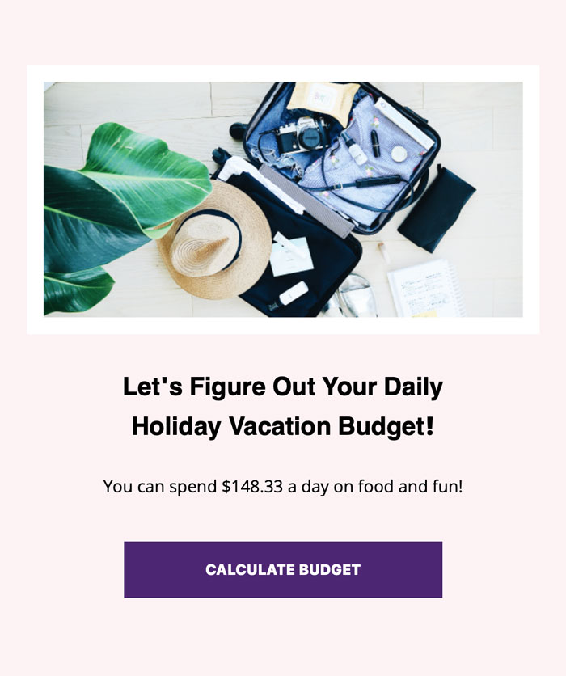

<h1><strong>Budget Your Vacay</strong></h1>

<h2>Objective</h2>

The program will capture data using prompts and then calculate the daily food and fun budget.

<h4>JavaScript Toolbox:</h4>

* querySelector()
* User input function
* prompt() & Number() 
* Click Event
* Calculation function
* Console Logging 

